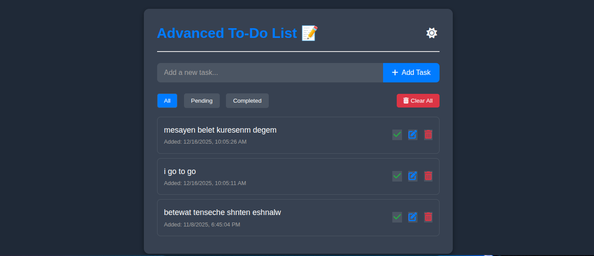

# 📝 Advanced To-Do List App

A modern, responsive **To-Do List Web App** built with **HTML, CSS, and JavaScript**.  
This app allows users to add, edit, delete, and manage daily tasks — all stored locally in the browser using `localStorage`.  
It features **dark mode**, **task filtering**, and a **clean UI** for a better user experience.

---

<p align="center">
  
</p>

## 🚀 Features

- ✅ **Add, Edit, and Delete** tasks easily
- 🌗 **Dark/Light Mode Toggle** (saves your preference)
- 🕒 **Task Timestamp** to track when tasks were created
- 🔍 **Filter Tasks** — View _All_, _Completed_, or _Pending_ tasks
- 💾 **Persistent Storage** using `localStorage`
- 🧹 **Clear All Tasks** option
- 📱 **Responsive Design** for desktop and mobile
- ✨ **Animated Transitions** for better UI flow

---

---

## 🧩 Tech Stack

- **HTML5** – Semantic structure
- **CSS3** – Custom styling and responsiveness
- **JavaScript (ES6)** – Dynamic interactions and localStorage integration

---

## 📦 Project Structure

```folder
advanced-todo-list-app
│
├── index.html # Main HTML file
├── style.css # Stylesheet
├── script.js # Core JavaScript logic
└── README.md # Project documentation
```

---

## ⚙️ Installation & Usage

1. **Clone the repository:**
   ```bash
   git clone https://github.com/daniiiiel00/30-Days-Challenge-for-me.git
   ```

## Navigate the folder

```bash
cd advanced-todo-list-app
```

## 🧠 How It Works

```js
When a user adds a task, it’s saved in the browser’s localStorage.

Each task object contains:

{
  id: 1,
  text: "Finish GitHub project",
  completed: false,
  createdAt: "2025-10-25T10:00:00Z"
}
```

## 🪄 Future Improvements

🔔 Notifications or reminders for due tasks

⏰ Task scheduling and priority levels

☁️ Sync tasks with Firebase or MongoDB

📱 Convert to a PWA (Progressive Web App)

## 📜 License

This project is licensed under the MIT License.
You’re free to use, modify, and distribute it with attribution.

## 💡 Author

Daniel Melese
🎓 Web Development & Database Administration
