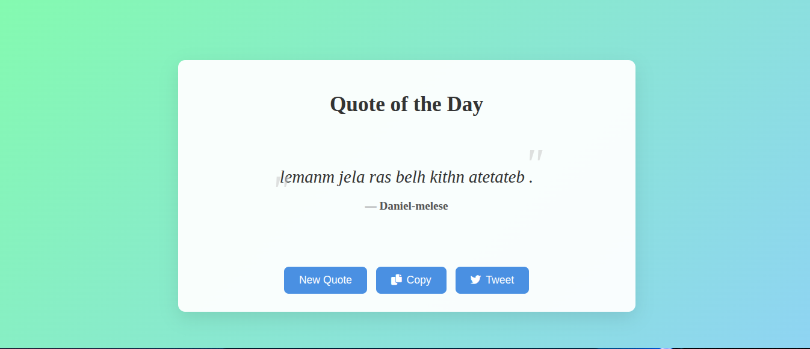

# 💬 Random Quote Generator

A simple, modern, and responsive **Random Quote Generator** built with **HTML, CSS, and JavaScript**.  
It displays inspiring quotes with options to copy or share them on social media.

---

<p align="center">
  
</p>

## 🚀 Features

- 🔁 Generate random quotes with one click
- 🧠 Display quote text and author dynamically
- 📋 **Copy Quote** button (copies to clipboard)
- 🐦 **Share on Twitter** button with prefilled tweet
- 🌈 Optional random background color or gradient on each quote
- 💾 Saves the last shown quote in `localStorage` (optional)
- 📱 Fully **responsive design** for mobile and desktop
- ⚡ Fast, clean, and lightweight

---

## 🧩 Tech Stack

- **HTML5** – Structure
- **CSS3** – Modern, responsive design
- **JavaScript (ES6)** – Quote generation, API fetch, copy/share functions

---

## 📂 Project Structure

```folder
📁 random-quote-generator
│
├── index.html # App layout and buttons
├── style.css # Styling and animations
├── script.js # Logic for quotes, copy, and share
└── README.md # Documentation

```

---

## ⚙️ Installation & Usage

1. **Clone the repository**

   ```bash
   git clone https://github.com/daniiiiel00/30-Days-Challenge-for-me.git


   ```

## Navigate into the project folder

```bash
cd random-quote-generator
```

## Run the app

Open index.html in your browser.

## 🌐 API Option

```js
If you want to fetch quotes dynamically, you can use the free Type.fit Quotes API
:
fetch("https://type.fit/api/quotes")
.then(res => res.json())
.then(data => {
const random = Math.floor(Math.random() \* data.length);
quoteText.textContent = data[random].text;
quoteAuthor.textContent = data[random].author || "Unknown";
});
```

## 🪄 Future Enhancements

🎤 Add voice reading for quotes

📸 Add a “Save as Image” option for sharing quotes

🕐 Daily quote scheduling

☁️ Sync with online quote databases

## 🤝 Contributing

Contributions, issues, and suggestions are welcome!
Fork the repo and submit a pull request to improve the project.

## 📜 License

Licensed under the MIT License – free to use and modify.

## 👨‍💻 Author

Daniel Melese
🎓 Diploma in Web Development & Database Administration
