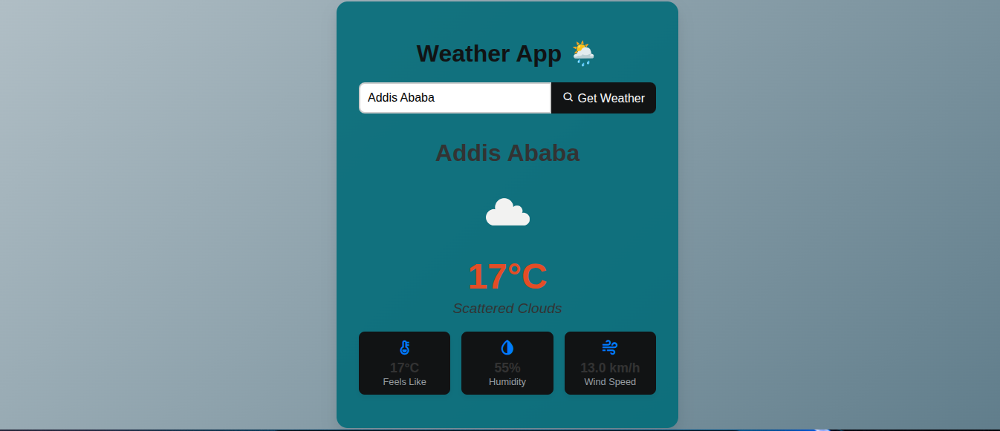

# 🌦️ Weather App

A simple and responsive **Weather Web App** built with **HTML, CSS, and JavaScript**, using real-time weather data from the **OpenWeatherMap API**.  
Enter a city name to instantly view current weather details such as temperature, condition, and weather icon.

---

<p align="center">
  
</p>

## 🚀 Features

- 🔍 Search weather by city name
- 🌡️ Displays temperature, condition, and weather icon
- ⚠️ Shows error message for invalid or unknown city
- 📱 Fully responsive design for desktop and mobile
- ☁️ Fetches live data from OpenWeatherMap API
- 🎨 Clean and minimal user interface
- 💨 Optional: displays humidity, wind speed, and feels-like temperature

---

## 🧩 Tech Stack

- **HTML5** – Structure
- **CSS3** – Styling and responsive layout
- **JavaScript (ES6)** – Fetch API integration and DOM updates
- **OpenWeatherMap API** – Live weather data source

---

## 📂 Project Structure

```folder
📁 weather-app
│
├── index.html # App layout
├── style.css # Styling and responsiveness
├── script.js # Weather fetch logic
└── README.md # Documentation
```

---

## ⚙️ Installation & Usage

1. **Clone the repository**
   ```bash
   git clone https://github.com/daniiiiel00/30-Days-Challenge-for-me.git
   ```

Navigate to the project folder

cd weather-app

Open the app
Open index.html in your browser.

🔑 Get Your OpenWeatherMap API Key

Go to https://openweathermap.org/api

Create a free account and log in

Generate your API key

Replace YOUR_API_KEY in script.js with your actual key

const apiKey = "YOUR_API_KEY";

🧠 Example API Call

https://api.openweathermap.org/data/2.5/weather?q=London&units=metric&appid=YOUR_API_KEY

🪄 Future Enhancements

🌍 Detect user location automatically

🎨 Dynamic background based on weather condition

📅 5-day weather forecast view

🕒 Add real-time clock and date

🤝 Contributing

Contributions and feature suggestions are always welcome!
Feel free to fork this repo and open a pull request.

📜 License

This project is licensed under the MIT License – free for personal and commercial use.

👨‍💻 Author

Daniel Melese
🎓 Diploma in Web Development & Database Administration
