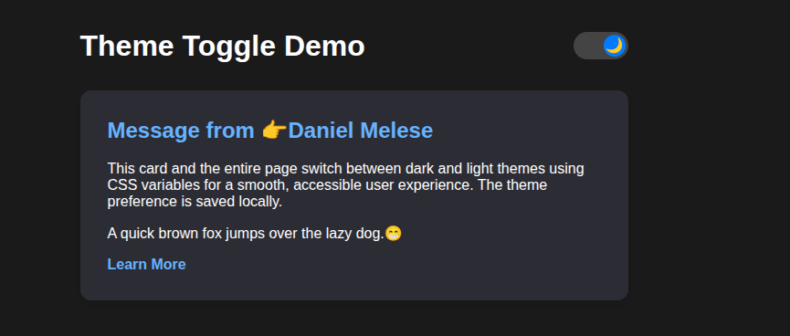

# 🌓 Dark/Light Theme Toggle

A simple and elegant **Dark/Light Theme Toggle** web project built using **HTML, CSS, and JavaScript**.  
It allows users to switch between dark and light modes smoothly, with their preference saved using `localStorage`.

---

<p align="center">
  
</p>

## 🚀 Features

- 🌗 Toggle between **Dark** and **Light** themes
- 💾 **Saves user preference** in `localStorage`
- ✨ **Smooth transition** animation between themes
- 📱 **Responsive design** for desktop and mobile
- 🎨 **CSS Variables** used for theme customization
- ☀️/🌙 Optional icons for visual toggle indicator

---

## 🧩 Tech Stack

- **HTML5** – Page structure
- **CSS3** – Theming with variables and transitions
- **JavaScript (ES6)** – Theme toggle and preference saving

---

## 📂 Project Structure

```folder
📁 dark-light-theme-toggle
│
├── index.html # Structure and toggle button
├── style.css # Theme styling and variables
├── script.js # Toggle logic and localStorage
└── README.md # Project documentation
```

---

## ⚙️ Installation & Usage

1. **Clone the repository**

   ```bash
   git clone https://github.com/daniiiiel00/30-Days-Challenge-for-me.git


   ```

   Open the project folder

cd dark-light-theme-toggle

Run the app
Open index.html in your browser.

🧠 How It Works

The app defines color variables for both light and dark themes in style.css.

Clicking the toggle switch changes the theme and stores the user’s choice in localStorage.

On page load, the app checks the stored preference and applies it automatically.

🪄 Future Enhancements

🧭 Add system-theme auto detection

🌈 Allow users to customize accent colors

📱 Add toggle animation or sound effect

🤝 Contributing

Contributions and improvements are welcome!
Fork the repo, make changes, and open a pull request.

📜 License

This project is licensed under the MIT License – free to use, modify, and distribute.

👨‍💻 Author

Daniel Melese
🎓 Diploma in Web Development & Database Administration
