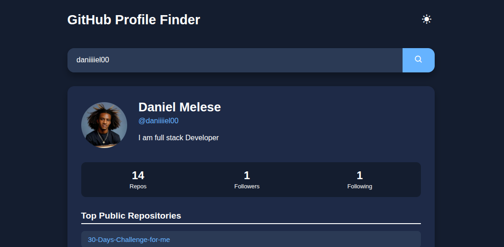

# 👤 GitHub Profile Finder

A simple and modern **GitHub Profile Finder Web App** built using **HTML, CSS, and JavaScript**.  
It allows users to search any GitHub username and view profile information instantly by fetching real-time data from the **GitHub API**.

---

<p align="center">
  
</p>

## 🚀 Features

- 🔍 Search for any GitHub user by username
- 🧠 Fetch and display real-time user data from the GitHub API
- 🖼️ Displays avatar, name, username, bio, followers, following, and repositories count
- 🌐 Includes a direct link to the GitHub profile
- ⚠️ Shows an error message if the username is not found
- 📱 Fully responsive and mobile-friendly design
- 💾 Lightweight, fast, and API-driven

---

## 🧩 Tech Stack

- **HTML5** – Structure
- **CSS3** – Styling and responsiveness
- **JavaScript (ES6)** – Fetch API integration and dynamic content
- **GitHub REST API** – Data source

---

## 📂 Project Structure

```folder
📁 github-profile-finder
│
├── index.html # App structure and search input
├── style.css # Styling and layout
├── script.js # API fetch logic and rendering
└── README.md # Documentation
```

---

## ⚙️ Installation & Usage

1. **Clone the repository**

   ```bash
   git clone https://github.com/daniiiiel00/30-Days-Challenge-for-me.git


   ```

   Open the project folder

cd github-profile-finder

Run the app
Open index.html in your browser.

🔗 Example API Endpoint
https://api.github.com/users/octocat

🧠 How It Works

The app uses the Fetch API to get user data from GitHub’s REST API.

Once a username is entered, it dynamically updates the UI with profile info such as avatar, name, followers, and repository count.

If the username doesn’t exist, an error message appears.

🪄 Future Enhancements

📊 Display user’s top repositories

🌗 Add dark/light mode toggle

⏳ Add loading spinner animation

🔎 Include search history feature

🤝 Contributing

Contributions and ideas are always welcome!
Fork the repository, make your changes, and submit a pull request.

📜 License

This project is licensed under the MIT License — free to use, modify, and distribute.

👨‍💻 Author

Daniel Melese
🎓 Diploma in Web Development & Database Administration
