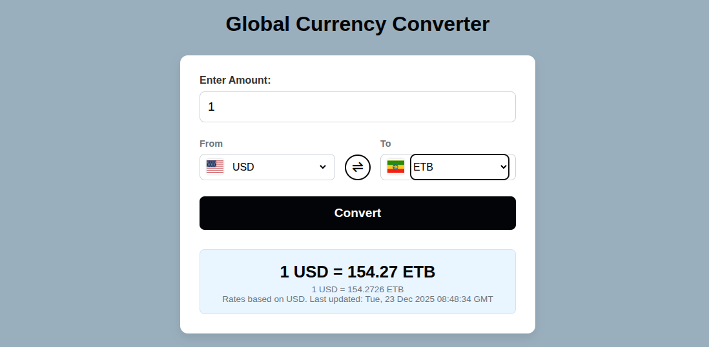

# 💱 Currency Converter Web App

A simple and responsive **Currency Converter App** built using **HTML, CSS, and JavaScript**.  
It fetches real-time exchange rates from a free API and allows users to convert amounts between different currencies instantly.

---

<p align="center">
  
</p>

## 🚀 Features

- 🔄 Convert any amount between two currencies
- 🌍 Uses real-time exchange rates from a public API
- 🧾 Simple and clean user interface
- ⚡ Instant conversion results
- 📱 Fully responsive design for mobile and desktop
- 💡 Lightweight and fast — no frameworks required
- 💬 Include flag icons for currencies

---

## 🧩 Tech Stack

- **HTML5** – Page structure
- **CSS3** – Styling and responsive design
- **JavaScript (ES6)** – Logic and API integration
- **Exchange Rate API** – Currency data source

---

## 📂 Project Structure

```folder
📁 currency-converter
│
├── index.html # Layout structure
├── style.css # Styling and responsiveness
├── script.js # Fetch API and conversion logic
└── README.md # Documentation
```

---

## ⚙️ Installation & Usage

1. **Clone the repository**

   ```bash
   git clone https://github.com/daniiiiel00/30-Days-Challenge-for-me.git


   ```

   Open the project folder

cd currency converter

Run the app
Open index.html in your browser.

🔗 API Used

The app uses the ExchangeRate API to get real-time currency exchange data.

Example endpoint:

https://api.exchangerate-api.com/v4/latest/USD

🧠 How It Works

The app fetches the latest exchange rates from the API.

Users select the source and target currencies and enter an amount.

On clicking Convert, the converted amount is displayed instantly.

🪄 Future Enhancements

📊 Add charts to show currency trends

🔄 Auto-update rates periodically

🌗 Add dark/light theme toggle

🤝 Contributing

Contributions, ideas, and feedback are welcome!
Fork the project, make improvements, and submit a pull request.

📜 License

This project is licensed under the MIT License — you’re free to use, modify, and distribute it.

👨‍💻 Author

Daniel Melese
🎓 Diploma in Web Development & Database Administration
