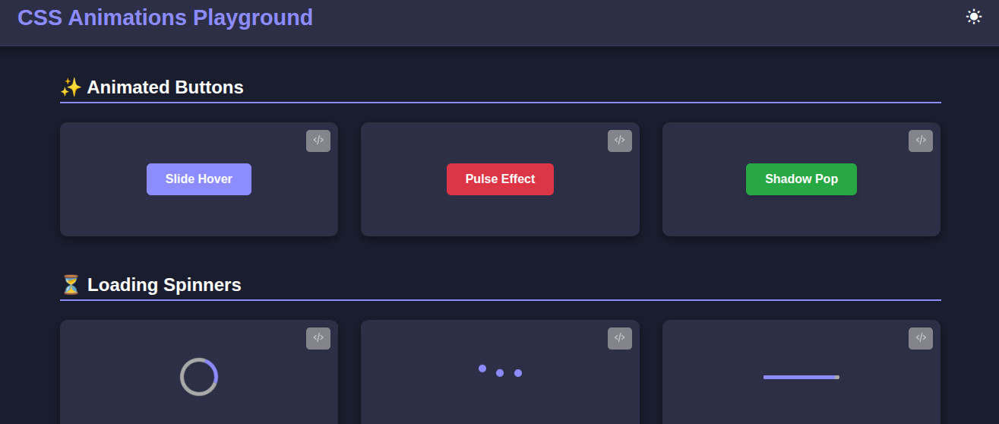
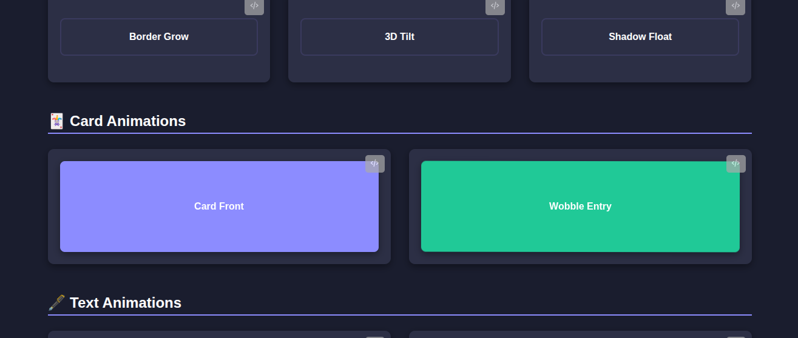

# ✨ CSS Animations Playground

A beautiful collection of **CSS animations** including buttons, hover effects, loaders, text effects, and card interactions.  
This project is designed as a creative playground to explore modern CSS animation techniques using `@keyframes`, `transitions`, and `transform`.

Perfect for beginners and advanced developers looking for reusable animation snippets for real projects.

---

<p align="center">
  
</p>

<p align="center">
  
</p>

## 🚀 Features

- 🎛️ Multiple animated button styles
- 🔄 Loading spinners and progress animations
- 🖱️ Creative hover effects
- 🃏 Animated cards and UI elements
- 🔤 Text typing, fade, slide, and bounce effects
- 📱 Fully responsive layout
- 🎨 Built with pure HTML + CSS (optional small JS interactions)
- 🌗 Dark/Light mode switch
- 📦 Add "Copy CSS" button for each animation

---

## 🧩 Tech Stack

- **HTML5** – structure
- **CSS3** – animations, transitions, variables, layout
- **JavaScript (optional)** – toggles or triggers

---

## 📂 Project Structure

```folder
📁 css-animations-playground
│
├── index.html # Animation showcase layout
├── style.css # All animations & styling
├── script.js # Optional interactions
└── README.md # Documentation
```

---

## ⚙️ Installation & Usage

1. Clone the repository:

```bash
git clone https://github.com/daniiiiel00/30-Days-Challenge-for-me.git

```

## 2 Open the project folder:

```bash
cd css animations-playground
```

## 3 Run the playground:

Open index.html in your browser.

## 🧠 How It Works

Each animation is created using @keyframes, transition, and transform.

The page displays all animations in grouped sections (Buttons, Loaders, Hover Effects, etc.).

Animations are reusable and easy to copy into any project.

## 🪄 Future Enhancements

🧩 Add more animation categories

🖼️ Add preview modals

📘 Add interactive documentation inside the site

## 🤝 Contributing

Feel free to fork the project, create your own animations, and submit a pull request!

## 📜 License

This project is licensed under the MIT License.

## 👨‍💻 Author

Daniel Melese
Web Developer — HTML, CSS, JavaScript, PHP, SQL
