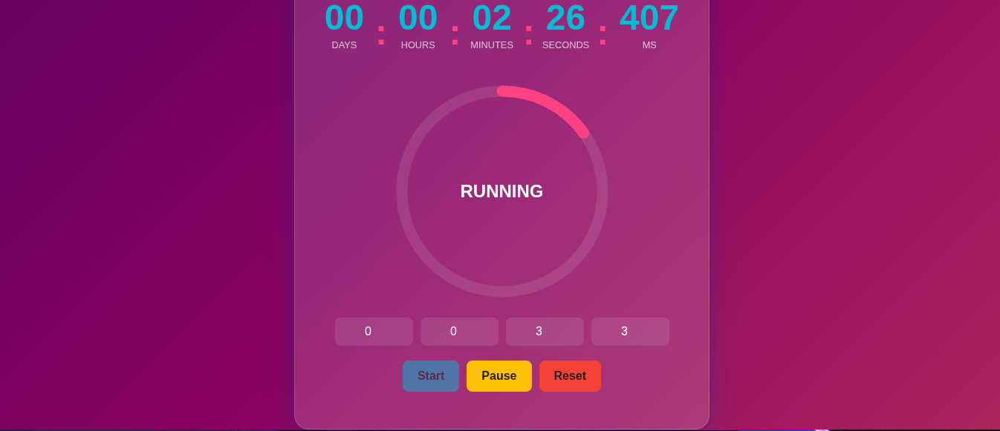

# ⏳ Countdown Timer Web App

A modern and responsive **Countdown Timer** built with **HTML, CSS, and JavaScript**.  
Displays time in **days, hours, minutes, seconds, and milliseconds** with smooth animations and a polished UI.

---

<p align="center">
  
</p>

## 🚀 Features

✨ Live countdown with millisecond precision  
⏱️ Displays days, hours, minutes, seconds, and milliseconds  
🎨 Smooth UI animations and transitions  
📱 Fully responsive for mobile, tablet, and desktop  
⚡ High-performance time updates  
🧼 Clean and modern layout

---

## 🛠️ Technologies Used

- 🌐 HTML5
- 🎨 CSS3 (Flexbox / Grid / Animations)
- ⚙️ JavaScript (Vanilla JS)

---

## 📂 Project Structure

```bash
countdown-timer/
│── index.html
│── style.css
│── script.js
│── README.md
```

---

## ▶️ How It Works

1. User sets a future date and time
2. JavaScript calculates the remaining time
3. Timer updates in real-time with millisecond precision
4. Smooth animations update the UI dynamically
5. Timer stops automatically when time reaches zero

---

## 💻 Installation & Usage

1. Clone the repository:

```bash
git clone https://github.com/daniiiiel00/30-Days-Challenge-for-me.git

```

## Navigate to the project folder:

```bash
cd countdown-timer
```

## Open in browser:

open index.html

(or double-click the file)

## 🎨 UI Highlights

- Soft shadows and rounded cards

- Animated number transitions

- Minimal color palette

- Smooth hover and focus effects

## 🌟 Future Improvements

- 🔔 Alarm / sound notification
- 🌗 Dark & Light mode
- 📆 Preset countdown templates
- 📊 Progress ring animation

## 📜 License

This project is open-source and available under the MIT License.

## 👨‍💻 Author

Daniel Melese
Full-stack Developer | UI Enthusiast
